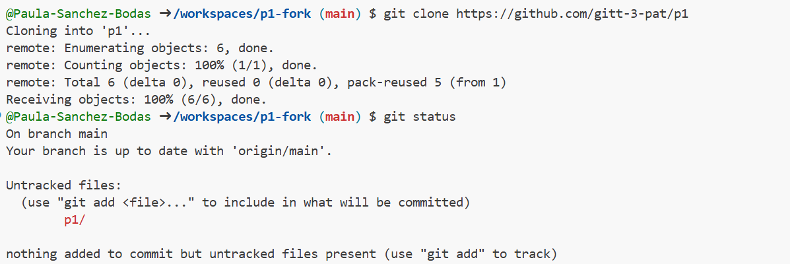
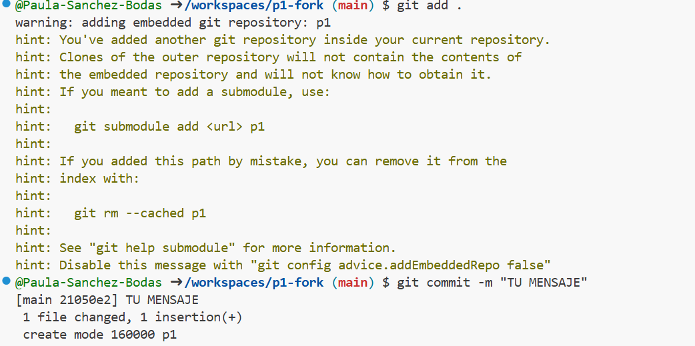
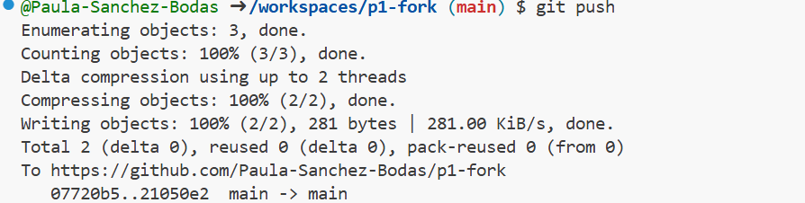
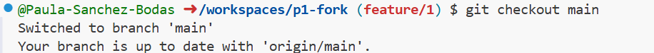
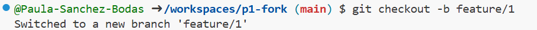

# Práctica 1

Un repositorio para empezar a usar [git](https://git-scm.com/) y Github

## ¿Como probar en la nube?

[Github-Codespaces](https://github.com/features/codespaces)

## Comandos git básicos

```
git clone https://github.com/gitt-3-pat/p1
git status
git add .
git commit -m "TU MENSAJE"
git push

git checkout -b feature/1
git checkout main
```

## ¿Cómo escribir un README.md con formato?

[Github Markdown](https://docs.github.com/es/get-started/writing-on-github/getting-started-with-writing-and-formatting-on-github/basic-writing-and-formatting-syntax)

## MEMORIA DE LA PRÁCTICA 1 

## git clone
Clona un repositorio remoto para crear una copia local.
## git status
Verifica el estado actual del repositorio local, mostrando archivos modificados, nuevos, o eliminados.



## git add
Agrega cambios de archivos al área de preparación para el próximo commit.
## git commit
Registra los cambios preparados en el historial del repositorio.



## git push
Sube los cambios locales al repositorio remoto.


## git checkout
Cambia entre ramas. 

## git checkout -b
Crea una nueva rama. 


